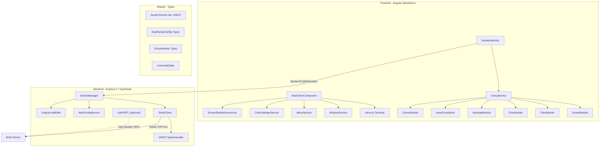

# WebMud3 Migrationsplan: Master (u1) → Develop (u2)

## 1. Kontext

Die **Zielarchitektur** ist `u2_webmud3_develop` (TypeScript-Monorepo, Angular Standalone Components, xterm.js, Express 5). Der **Feature-Spender** ist `u1_webmud3_master` (Plain JS, PrimeNG, HTML-Span-Rendering, Express 4), der zahlreiche Features enthält, die in u2 noch fehlen.

### 1.1 Technologische Grundlagen der Zielarchitektur (u2)

| Aspekt                 | u2 (Develop – Ziel)                          |
|------------------------|-----------------------------------------------|
| **Backend-Sprache**    | TypeScript (strict)                           |
| **Projekt-Struktur**   | npm Workspaces Monorepo (shared/backend/frontend) |
| **Shared-Paket**       | `@webmud3/shared` – typisierte Socket-Events  |
| **Angular-Stil**       | Standalone Components, `inject()` statt Constructor DI |
| **Terminal-Rendering**  | xterm.js mit FitAddon, ClipboardAddon, AttachAddon |
| **UI-Framework**       | Eigenes SCSS (kein PrimeNG)                   |
| **Express**            | v5                                            |
| **Logging**            | Winston                                       |
| **Testing**            | Jest (Frontend + Backend)                     |
| **CI/CD**              | GitHub Actions → Azure Web App                |
| **Accessibility**      | Custom ARIA-Live-Region ScreenReader-Announcer |
| **Reconnection**       | Session-Token + OutputLineBuffer-Replay       |

### 1.2 Feature-Bestand der Quellarchitektur (u1)

| Aspekt                 | u1 (Master – Quelle)                         |
|------------------------|-----------------------------------------------|
| **Backend-Sprache**    | Plain JavaScript (ES6+)                       |
| **Projekt-Struktur**   | Separate Packages (kein Monorepo)             |
| **Angular-Stil**       | NgModules                                     |
| **Terminal-Rendering**  | HTML-Spans mit eigenem AnsiService            |
| **UI-Framework**       | PrimeNG (Nora Theme)                          |
| **Express**            | v4                                            |
| **Logging**            | Custom ngxlogger                              |
| **CI/CD**              | Jenkinsfile + Docker Compose                  |
| **GMCP-Support**       | Umfangreich (15+ Module)                      |
| **Code-Editor**        | Ace Editor (37 Themes)                        |
| **Fenster-System**     | Eigenes Draggable/Resizable                   |

---

## 2. Analyse der Feature-Lücken

Die folgende Tabelle zeigt alle wesentlichen Features, die von u1 nach u2 migriert werden müssen:

| Feature | u1 (Master) | u2 (Develop) | Aufwand |
|---------|-------------|--------------|---------|
| GMCP-Protokoll | Vollständig (15+ Module) | Stub (`sendGmcp` wirft Error) | Hoch |
| Multi-MUD-Support | 4 MUDs + Familien-System | Single-MUD via Env-Vars | Hoch |
| Sound-System | GMCP Sound.Url/Event + HTML5 Audio | Nicht vorhanden | Mittel |
| Datei-Browser + Code-Editor | Ace Editor (37 Themes) + DirList | Nicht vorhanden | Hoch |
| Fenster-System (Modeless) | Eigenes Draggable/Resizable | Nicht vorhanden | Hoch |
| Inventar-Anzeige | GMCP Char.Items | Nicht vorhanden | Mittel |
| Charakter-Statistiken | GMCP Char.Status/Vitals/Stats | Nicht vorhanden | Mittel |
| Menü-System | PrimeNG Menubar, dynamisch | Nicht vorhanden | Mittel |
| Numpad/Keypad | MUD-synchron, konfigurierbar | Nicht vorhanden | Mittel |
| Farbeinstellungen | Invertierung, B/W, Farben aus | Nur xterm-Theme | Niedrig |
| Tab-Completion | GMCP Input.Complete | Nicht vorhanden | Niedrig |
| Auth/RPC (experimentell) | REST Login + Unix-Socket RPC | Auskommentiert | Niedrig |
| Multi-Deployment | 5+ Environment-Configs | 2 Environments (Dev/Prod) | Niedrig |
| mdconn Microservice | Experimentell | Nicht vorhanden | Niedrig |

---

## 3. Migrationsprinzipien

1. **Keine Rückschritte**: Accessibility (Screen Reader), TypeScript Strict, xterm.js, Standalone Components, Session-Token-Reconnection bleiben erhalten.
2. **Typisierung**: Alle migrierten Features müssen vollständig typisiert sein (kein `any`).
3. **Shared-First**: Neue Socket-Events und Typen immer zuerst in `@webmud3/shared` definieren.
4. **Strategy Pattern statt Hardcoding**: MUD-Familien-spezifisches Verhalten über austauschbare Handler, nicht über `if (family === 'unitopia')`.
5. **Lazy Loading**: GMCP-Feature-Module nur laden wenn aktiviert.
6. **Tests**: Jeder neue Handler/Service braucht Unit-Tests (Jest).
7. **Barrierefreiheit**: Alle neuen UI-Elemente (Fenster, Menüs, Dialoge) müssen ARIA-Attribute und Keyboard-Navigation unterstützen.

---

## 4. Migrationsstruktur (4 Phasen)

Die Migration wird in **4 Phasen** organisiert, geordnet nach Abhängigkeiten:

```
Phase 1: Infrastruktur (GMCP-Grundlagen, Multi-MUD)
    │
    ▼
Phase 2: UI-Framework (Fenstersystem, Menü, Farbeinstellungen)
    │
    ▼
Phase 3: GMCP-Feature-Module (Sound, Files, Char, Input, Numpad, Comm)
    │
    ▼
Phase 4: Deployment & Optionales (Routing, Multi-Deploy, Auth, mdconn)
```

---

### Phase 1: Infrastruktur-Erweiterungen (Grundlagen)

Schafft die Voraussetzungen für alle weiteren Features.

#### 1.1 GMCP-Protokoll im Backend

**Ziel:** Der Backend-TelnetClient kann GMCP-Nachrichten empfangen und senden.

**Referenz-Implementierung:** `u1_webmud3_master/backend/mudSocket.js` (Zeilen 276–353)

**Aufgaben:**

- Neuen Telnet-Option-Handler `handle-gmcp-option.ts` in `u2_webmud3_develop/backend/src/features/telnet/utils/` erstellen
- GMCP als `TELOPT_GMCP (201)` in `u2_webmud3_develop/backend/src/features/telnet/models/telnet-options.ts` registrieren
- Subnegotiation-Parsing implementieren:
  - Eingehend: Buffer → String → Split bei erstem Leerzeichen → `{module}.{message}` + JSON-Daten
  - Format: `"Core.Hello {\"client\":\"WebMud3\"}"` → `module="Core"`, `message="Hello"`, `data={client:"WebMud3"}`
- GMCP-Outgoing implementieren: `writeSub(201, Buffer.concat([moduleMsg, jsonData]))`
- GMCP-WILL-Handling: Wenn MUD `WILL GMCP` sendet → `DO GMCP` antworten (wenn MUD-Familie GMCP unterstützt)
- Event-Emission: `TelnetClient` emittiert `gmcpIncoming(module, message, data)` und `gmcpStart(gmcpSupport)`

**Schnittstelle:**
```typescript
// In TelnetClient (EventEmitter)
interface TelnetClientEvents {
  // ... bestehende Events ...
  gmcpIncoming: (module: string, message: string, data: unknown) => void;
  gmcpStart: (gmcpSupport: GmcpSupport) => void;
}

// Neuer Handler
interface GmcpOptionHandler extends TelnetOptionHandler {
  sendGmcp(module: string, message: string, data: unknown): void;
}
```

#### 1.2 GMCP Socket-Events im Shared-Paket

**Ziel:** Typisierte Socket.IO-Events für GMCP-Kommunikation zwischen Frontend und Backend.

**Aufgaben:**

- Neue Typen-Dateien in `u2_webmud3_develop/shared/src/` anlegen:

```typescript
// shared/src/gmcp/gmcp-types.ts
export interface GmcpModuleConfig {
  version: string;
  standard: boolean;
  optional: boolean;
}

export interface GmcpSupport {
  [moduleName: string]: GmcpModuleConfig;
}

export interface MudFamilyConfig {
  charset: string;
  MXP: boolean;
  GMCP: boolean;
  GMCP_Support: GmcpSupport;
}

export interface MudConfig {
  name: string;
  host: string;
  port: number;
  ssl: boolean;
  rejectUnauthorized: boolean;
  description: string;
  playerlevel: string;
  mudfamily: string;
}

export interface MudConfigFile {
  scope: string;
  href: string;
  mudfamilies: Record<string, MudFamilyConfig>;
  muds: Record<string, MudConfig>;
  routes: Record<string, string>;
}
```

- Bestehende Socket-Events erweitern:

```typescript
// ClientToServerEvents – neue Events:
mudGmcpOutgoing: (module: string, message: string, data: unknown) => void;

// ServerToClientEvents – neue Events:
mudGmcpIncoming: (module: string, message: string, data: unknown) => void;
mudGmcpStart: (gmcpSupport: GmcpSupport) => void;
```

- In `shared/src/index.ts` re-exportieren
- `npm run build --workspace shared` ausführen

#### 1.3 Multi-MUD-Konfiguration im Backend

**Ziel:** Das Backend unterstützt dynamische MUD-Auswahl pro Verbindung statt fester Env-Vars.

**Referenz:** `u1_webmud3_master/frontend/src/mud_config.json` und `u1_webmud3_master/backend/server.js`

**Aufgaben:**

- `MudConfigService` in `backend/src/core/config/` erstellen:
  - Lädt `mud_config.json` beim Start
  - Liefert MUD-Konfiguration nach MUD-ID
  - Liefert MUD-Familien-Konfiguration (GMCP-Support, Charset, etc.)
- `Environment` erweitern:
  - `TELNET_HOST/PORT` werden zu Fallback-Defaults
  - Neue Env-Var: `MUD_CONFIG_PATH` (Pfad zur `mud_config.json`)
- `SocketManager.mudConnect`-Event erweitern:
  - Neuer Parameter: `mudId?: string` (optional, für Rückwärtskompatibilität)
  - Wenn `mudId` gesetzt → Telnet-Verbindung zur konfigurierten Host/Port-Kombination
  - Wenn nicht gesetzt → Fallback auf Env-Var `TELNET_HOST/PORT`
- Neuer REST-Endpoint: `GET /api/mud-config` liefert MUD-Liste ans Frontend
- `ClientToServerEvents.mudConnect` Signatur erweitern:

```typescript
mudConnect: (
  initialViewPort: { columns: number; rows: number },
  sessionToken: string,
  mudId?: string,  // NEU
) => void;
```

#### 1.4 GMCP-Service im Frontend

**Ziel:** Zentraler Service für GMCP-Modul-Verwaltung und Event-Routing.

**Referenz:** `u1_webmud3_master/frontend/src/app/gmcp/gmcp.service.ts`

**Aufgaben:**

- Neuen Service `frontend/src/app/features/gmcp/gmcp.service.ts` erstellen:

```typescript
@Injectable({ providedIn: 'root' })
export class GmcpService {
  // Registry aller aktiven GMCP-Module pro Verbindung
  private moduleRegistry = new Map<string, GmcpModuleHandler>();

  // Observable-Streams für einzelne GMCP-Module
  public readonly gmcpEvent$ = new Subject<GmcpEvent>();

  registerModule(handler: GmcpModuleHandler): void { ... }
  unregisterModule(moduleName: string): void { ... }
  handleIncoming(module: string, message: string, data: unknown): void { ... }
  sendOutgoing(module: string, message: string, data: unknown): void { ... }
}
```

- `GmcpModuleHandler`-Interface definieren (Strategy Pattern):

```typescript
export interface GmcpModuleHandler {
  readonly moduleName: string;
  readonly version: string;
  handleMessage(message: string, data: unknown): void;
  getMenuItems?(): GmcpMenuItem[];
}
```

- MUD-Familien-spezifische Handler-Factory:
  - `GmcpHandlerFactory` erzeugt passende Handler basierend auf `mudfamily`
  - Statt hartcodiertem `unitopia`-Switch wie in u1
- Integration in `SocketsService`:
  - `mudGmcpIncoming`-Event → `GmcpService.handleIncoming()`
  - `mudGmcpStart`-Event → `GmcpService` initialisiert Module basierend auf `GmcpSupport`
  - `GmcpService.sendOutgoing()` → `socket.emit('mudGmcpOutgoing', ...)`

---

### Phase 2: UI-Framework und Fenstersystem

#### 2.1 Fenstersystem (Modeless Windows)

**Ziel:** Schwebende, verschiebbare und skalierbare Fenster für Editor, Stats, Keypad etc.

**Referenz:** `u1_webmud3_master/frontend/src/app/shared/window.service.ts` und `u1_webmud3_master/frontend/src/app/modeless/`

**Aufgaben:**

- Neues Feature-Verzeichnis: `frontend/src/app/features/windows/`
- `WindowService` als Injectable:
  - `windowConfigs` Signal oder BehaviorSubject für reaktive UI
  - Z-Index-Management (auto-increment bei Focus)
  - Parent-Child-Beziehungen für zusammengehörige Fenster
  - UUID-basierte Fenster-IDs
  - Event-System: `inComingEvents` / `outGoingEvents` per Subject
  - Aktionen: Focus, Hide, Save, Cancel, SaveAndClose, WinError
- `WindowContainerComponent` (Standalone):
  - Hostet alle aktiven Fenster
  - Rendert `WindowComponent`-Instanzen dynamisch
- `WindowComponent` (Standalone):
  - Titelleiste mit Schließen/Minimieren-Buttons
  - Drag-Funktionalität (Angular CDK DragDrop oder eigene Pointer-Events)
  - Resize-Handles (min-width/min-height Constraints)
  - ARIA-Attribute: `role="dialog"`, `aria-label`, Keyboard-Trap
- `WindowConfig`-Interface (typisiert):

```typescript
export interface WindowConfig {
  windowId: string;
  parentWindowId?: string;
  visible: boolean;
  title: string;
  tooltip?: string;
  initialLock: boolean;
  allowSave: boolean;
  showCancel: boolean;
  componentType: string;
  zIndex: number;
  position: { x: number; y: number };
  size?: { width: number; height: number };
  data?: unknown;
}
```

#### 2.2 Menü-System

**Ziel:** Dynamisches hierarchisches Menü für MUD-Steuerung und Feature-Zugriff.

**Referenz:** `u1_webmud3_master/frontend/src/app/menu/menu.service.ts`

**Aufgaben:**

- Neues Feature: `frontend/src/app/features/menu/`
- `MenuService`:
  - 3-Level-Hierarchie: Hauptmenü → Untermenü → Sub-Untermenü
  - Dynamische Items: Connect/Disconnect, Scroll-Lock, View-Settings, Numpad-Config
  - MUD-Liste als Connect-Optionen (aus Backend-Config)
  - GMCP-Module können eigene Menüpunkte registrieren (z.B. Sound Toggle)
- `MenuBarComponent` (Standalone):
  - Horizontale Menüleiste am oberen Bildschirmrand
  - Keyboard-Navigation (Arrow-Keys, Enter, Escape)
  - ARIA: `role="menubar"`, `role="menu"`, `role="menuitem"`
- **Entscheidung**: Leichtgewichtige eigene Lösung mit Angular CDK Overlay (empfohlen) oder PrimeNG Menubar. CDK bevorzugt, um Abhängigkeits-Overhead gering zu halten.

#### 2.3 Farbeinstellungen für xterm.js

**Ziel:** Benutzer können Terminal-Farben anpassen wie in u1.

**Referenz:** `u1_webmud3_master/frontend/src/app/mud/color-settings.ts` und `u1_webmud3_master/frontend/src/app/settings/color-settings/`

**Aufgaben:**

- `ColorSettingsService` in `frontend/src/app/features/settings/`:
  - Farb-Invertierung (alle Farben invertieren)
  - Schwarz-auf-Weiß-Modus (helle Umgebungen)
  - Farben-aus-Modus (monochrom)
  - Local-Echo-Farbe konfigurierbar (Standard: `#a8ff00`)
  - Persistenz: `localStorage` mit JSON (statt Base64-Cookie wie in u1)
- xterm.js Theme-API nutzen:
  - `terminal.options.theme = { background, foreground, cursor, ... }`
  - 16 ANSI-Farben einzeln überschreibbar
- `ColorSettingsComponent` (Standalone): Dialog/Panel für Farbeinstellungen
- Integration ins Menü-System (Phase 2.2)

---

### Phase 3: GMCP-Feature-Module

Jedes GMCP-Modul wird als eigenständiges Angular Feature implementiert, das den `GmcpModuleHandler` aus Phase 1.4 implementiert.

#### 3.1 Sound-Modul

**Ziel:** MUD-gesteuerte Audio-Wiedergabe.

**Referenz:** Sound-Handling in `u1_webmud3_master/frontend/src/app/mudconfig/unitopia.service.ts`

**Aufgaben:**

- `frontend/src/app/features/gmcp-sound/`
- `SoundGmcpHandler` implementiert `GmcpModuleHandler`:
  - `Sound.Url`: Speichert Base-URL für Sound-Dateien
  - `Sound.Event`: Spielt Sound ab via `new Audio(baseUrl + filename)`
- HTML5 Audio API (kein Web Audio API nötig – das ist nur für Beep)
- An/Aus-Toggle:
  - Registriert Menüpunkt über `GmcpService`
  - Toggle sendet `Core.Supports.Add "Sound 1"` / `Core.Supports.Remove "Sound 1"`
- Backend: GMCP Sound-Messages werden transparent durchgereicht (kein spezieller Handler nötig)

#### 3.2 Datei-Browser und Code-Editor

**Ziel:** In-Browser Code-Editor für MUD-Wizard-Dateien.

**Referenz:** `u1_webmud3_master/frontend/src/app/modeless/editor/editor.component.ts`, `u1_webmud3_master/frontend/src/app/modeless/dirlist/dirlist.component.ts`, `u1_webmud3_master/frontend/src/app/mud/files.service.ts`

**Aufgaben:**

- `frontend/src/app/features/gmcp-files/`
- `FilesGmcpHandler` implementiert `GmcpModuleHandler`:
  - `Files.DirectoryList`: Empfängt Verzeichnisinhalt → öffnet DirList-Fenster
  - `Files.OpenFile`: Empfängt Datei-URL → öffnet Editor-Fenster
  - `Files.FileSaved`: Bestätigung nach Speichern
  - `Files.ChDir`: Verzeichniswechsel
- `FilesService`:
  - HTTP GET für Datei-Laden
  - HTTP PUT für Datei-Speichern
  - Datei-Zustandsverwaltung (FileInfo mit Content, OldContent, Modified-Flag)
- `DirListComponent` (Standalone):
  - Verzeichnis-Anzeige in einem Modeless-Fenster
  - Navigation (Doppelklick auf Ordner → `Files.ChDir`)
  - Datei öffnen (Doppelklick auf Datei → `Files.OpenFile`)
- `EditorComponent` (Standalone):
  - **Editor-Wahl**: Ace Editor (bewährt, 37 Themes) – als `ace-builds` npm-Paket
  - Alternativ: CodeMirror 6 evaluieren (modernere API, besser für Tree-Shaking)
  - Syntax-Highlighting für C/C++ (`.c`, `.h`, `.inc`) und Text
  - Theme-Persistenz via localStorage
  - Suchen & Ersetzen
  - Speichern (Zwischen- und Abschluss-Speichern)
  - Schließen mit Warnung bei ungespeicherten Änderungen
  - Read-Only-Toggle
- Integration ins Fenster-System (Phase 2.1):
  - Editor und DirList werden als Fenster dargestellt
  - Parent-Child: DirList ist Parent von Editor

#### 3.3 Charakter-Module

**Ziel:** Anzeige von Charakter-Informationen (Name, Stats, Inventar).

**Referenz:** `u1_webmud3_master/frontend/src/app/mud/mud-signals.ts`, `u1_webmud3_master/frontend/src/app/modeless/char-stat/`, `u1_webmud3_master/frontend/src/app/widgets/inventory/`

**Aufgaben:**

- `frontend/src/app/features/gmcp-char/`
- `CharGmcpHandler` implementiert `GmcpModuleHandler`:
  - `Char.Name`: Charakter-Name und Titel → Browser-Titel-Update, Wizard-Erkennung
  - `Char.StatusVars`: Definiert verfügbare Status-Variablen
  - `Char.Status`: Aktuelle Werte (Gilde, Rasse, Rang)
  - `Char.Vitals`: HP/SP-Werte
  - `Char.Stats`: STR/INT/CON/DEX-Werte
- `CharacterData`-Klasse (typisiert):

```typescript
export interface CharacterData {
  name?: string;
  title?: string;
  isWizard: boolean;
  statusVars: Map<string, string>;
  status: Record<string, string | number>;
  vitals: { hp?: number; sp?: number; maxHp?: number; maxSp?: number };
  stats: { str?: number; int?: number; con?: number; dex?: number };
}
```

- `CharStatsComponent` (Standalone): Charakter-Statistik-Fenster
- `Char.Items`-Handler:
  - `Char.Items.List`: Empfängt vollständige Inventar-Liste
  - `Char.Items.Add`: Einzelnes Item hinzufügen
  - `Char.Items.Remove`: Item entfernen
- `InventoryComponent` (Standalone): Kategorisiertes Inventar-Widget
- `InventoryList`-Datenmodell:

```typescript
export interface InventoryItem {
  id: string;
  name: string;
  category?: string;
}

export interface InventoryList {
  items: InventoryItem[];
  categories: Map<string, InventoryItem[]>;
}
```

#### 3.4 Input-Completion

**Ziel:** Tab-Vervollständigung über GMCP.

**Referenz:** GMCP `Input.Complete` in u1

**Aufgaben:**

- `InputGmcpHandler` implementiert `GmcpModuleHandler`:
  - Tab-Taste im `MudInputController` → `Input.Complete` Request an MUD
  - Response-Typen:
    - `Text`: Direkte Ersetzung des aktuellen Worts
    - `Choice`: Auswahlliste anzeigen (Overlay)
    - `None`: Kein Match
- Integration in `MudInputController` (`frontend/src/app/features/terminal/mud-input.controller.ts`):
  - Neuer Callback für Tab-Events
  - Buffer-Manipulation bei erfolgreicher Completion
- Completion-Overlay-Component (Standalone):
  - Dropdown-Liste bei `Choice`-Response
  - Keyboard-Navigation (Arrow-Keys, Enter, Escape)

#### 3.5 Numpad/Keypad

**Ziel:** MUD-synchronisierte Tastenbelegung mit visuellem Numpad.

**Referenz:** `u1_webmud3_master/frontend/src/app/shared/keypad-data.ts`, `u1_webmud3_master/frontend/src/app/modeless/keypad/`

**Aufgaben:**

- `frontend/src/app/features/gmcp-numpad/`
- `NumpadGmcpHandler` implementiert `GmcpModuleHandler`:
  - `Numpad.SendLevel`: MUD sendet Tastenbelegung für eine Ebene
  - `Numpad.Update`: Client sendet geänderte Belegung zurück
  - `Numpad.GetAll`: Client fordert alle Ebenen an
- `KeypadData`-Datenmodell:

```typescript
export interface OneKeypadData {
  prefix: string;
  keys: Map<string, string>;  // Taste → Befehl
}

export interface KeypadData {
  levels: Map<string, OneKeypadData>;
  currentLevel: string;
}
```

- Modifier-Support: Shift, Ctrl, Alt, Meta + Numpad/F-Tasten
- `KeypadComponent` (Standalone): Visuelles anklickbares Numpad-Widget
- `KeypadConfigComponent` (Standalone): Konfigurations-Dialog im Fenster-System
- Integration in `MudInputController`: Numpad-Tasten abfangen und MUD-Befehl senden

#### 3.6 Kommunikations- und Kern-Module

**Ziel:** Weitere GMCP-Module für Kommunikation, Keep-Alive und Raum-Info.

**Aufgaben:**

- **`Core.Ping`**: Keep-Alive mit visueller Anzeige
  - Periodischer Ping → Latenz-Messung
  - Status-Anzeige (z.B. im Menü oder als Badge)
- **`Core.BrowserInfo`**: Geräte-Info an MUD senden
  - Browser, OS, Version, Typ (Mobile/Tablet/Desktop)
  - Client-ID (UUID pro Session)
  - `real_ip` wird im Backend ergänzt (aus `x-forwarded-for`)
  - Alternative zu `ngx-device-detector`: Native `navigator.userAgent` Parsing oder `ua-parser-js`
- **`Core.Hello`**: MUD/Client-Identifikation beim Verbindungsaufbau
- **`Core.Goodbye`**: Logoff-Ankündigung vom MUD
- **`Core.Supports`**: Set/Add/Remove von GMCP-Modulen
  - Wird vom `GmcpService` automatisch verwaltet
- **`Comm.Say/Soul/Tell`**: Kommunikationskanäle
  - Optional: Separate Anzeige in eigenem Panel
  - Minimal: Als regulärer MUD-Output durchreichen
- **`Room.Info`**: Raum-Information (Name, Domain, Exits)
  - Optional: Raum-Name in Titelleiste
  - Optional: Exit-Buttons/Links

---

### Phase 4: Deployment und Infrastruktur

#### 4.1 Multi-MUD-Routing im Frontend

**Ziel:** Verschiedene MUDs über URL-Pfade auswählbar.

**Referenz:** `u1_webmud3_master/frontend/src/app/nonportal/` und `mud_config.json` Routes

**Aufgaben:**

- Dynamische Routen aus `mud_config.json`:
  - `"/"` → UNItopia, `"/orbit"` → Orbit, `"/seifenblase"` → Seifenblase etc.
- Angular Router konfigurieren:
  - Parametrisierte Route: `/:mudId` statt hartcodierter Nonportal-Pages
  - Default-Route aus Config
- `MudSelectorComponent` (Standalone): Landing-Page mit MUD-Auswahl (wenn keine spezifische Route)
- `MudService.connect()` erweitern: `mudId` aus Router-Parameter übergeben

#### 4.2 Multi-Deployment-Konfiguration

**Ziel:** Verschiedene Deployment-Szenarien unterstützen.

**Referenz:** `u1_webmud3_master/frontend/src/environments/` (5+ Dateien)

**Aufgaben:**

- Zusätzliche Environment-Files:
  - `environment.prod.sb.ts` (Seifenblase)
  - `environment.prod.uni.ts` (UNItopia Produktion)
- `ServerConfigService` erweitern:
  - URL-basierte Backend-Erkennung (Referenz: `u1_webmud3_master/frontend/src/app/shared/server-config.service.ts`)
  - Origin/Path-Matching für verschiedene Deployments
- Docker Compose Varianten:
  - Lokales Deployment
  - Produktion (UNItopia)
  - Seifenblase
  - Mit Apache Reverse-Proxy
  - Secret-Management
- `angular.json`: File-Replacements für zusätzliche Build-Konfigurationen

#### 4.3 Auth/RPC (optional)

**Ziel:** Experimentelle Authentifizierung gegen den MUD-Server.

**Referenz:** `u1_webmud3_master/backend/mudrpc/`

**Aufgaben:**

- REST-Auth-Routes in TypeScript portieren:
  - `POST /api/auth/login` → RPC `mud.password` Validierung
  - `POST /api/auth/logout` → Session beenden
  - `GET /api/auth/loggedon` → Status abfragen
- `LdjClient` (Line-Delimited JSON) in TypeScript portieren
- `MudRpc` Request/Response-Protokoll mit ID-basiertem Caching in TypeScript
- `RpcClient` mit Lazy-Connection und Auto-Reconnect
- Cookie-Session-Middleware reaktivieren (`use-cookie-session.ts` existiert bereits in u2)
- GMCP `Char.Login`: JWT-Token-basiertes Auto-Login (konzeptionell aus u1)

#### 4.4 mdconn-Microservice (optional)

**Ziel:** RPC-Bridge zum MUD-Server über Unix-Socket.

**Referenz:** `u1_webmud3_master/mdconn/`

**Aufgaben:**

- TypeScript-Portierung des LDJ-Protokolls
- Eigenes `mdconn/`-Paket im Monorepo (oder separates Repository)
- Docker Compose Integration
- Dokumentation der IPC-Schnittstelle

---

## 5. Architektur-Diagramm: Zielzustand



---

## 6. Empfohlene Reihenfolge und Priorisierung

| Priorität | Phase | Begründung |
|-----------|-------|------------|
| **Kritisch** | 1.1 + 1.2 + 1.4 (GMCP Grundlagen) | Voraussetzung für alle GMCP-Features |
| **Hoch** | 1.3 (Multi-MUD) | Kernfunktionalität für Produktivbetrieb |
| **Hoch** | 2.1 (Fenstersystem) | Voraussetzung für Editor, Stats, Keypad |
| **Hoch** | 3.2 (Datei-Editor) | Wichtigstes Wizard-Tool |
| **Mittel** | 3.1 (Sound) | Erlebnis-Feature |
| **Mittel** | 3.3 (Char-Module) | Gameplay-relevant |
| **Mittel** | 2.2 (Menü) | UX-Verbesserung |
| **Mittel** | 3.5 (Numpad) | Komfort-Feature |
| **Niedrig** | 2.3 (Farbeinstellungen) | Nice-to-have |
| **Niedrig** | 3.4 (Tab-Completion) | Komfort |
| **Niedrig** | 3.6 (Comm-Module) | Ergänzend |
| **Niedrig** | 4.1 (Multi-MUD-Routing) | Deployment |
| **Niedrig** | 4.2 (Multi-Deployment) | Deployment |
| **Optional** | 4.3 (Auth/RPC) | Experimentell |
| **Optional** | 4.4 (mdconn) | Experimentell |

---

## 7. Aufwandsschätzung

| Phase | Geschätzter Aufwand | Beschreibung |
|-------|---------------------|--------------|
| Phase 1 | 3–5 Wochen | GMCP-Grundlagen + Multi-MUD |
| Phase 2 | 2–4 Wochen | Fenstersystem + Menü + Farben |
| Phase 3 | 4–8 Wochen | Alle GMCP-Feature-Module |
| Phase 4 | 1–3 Wochen | Deployment + Optionales |
| **Gesamt** | **10–20 Wochen** | Je nach Priorisierung und Parallelisierung |

---

## 8. Risiken und Mitigationen

| Risiko | Auswirkung | Mitigation |
|--------|------------|------------|
| xterm.js unterstützt kein HTML-Rendering für ANSI-Spans | Farbeinstellungen weniger flexibel als u1 | xterm.js Theme-API und Addon-System nutzen |
| Ace Editor Bundle-Größe (~1MB) | Frontend-Performance | Lazy Loading, nur laden wenn Editor geöffnet |
| PrimeNG-Abhängigkeit vermeiden | Eigene UI-Komponenten nötig | Angular CDK für Overlays, Drag&Drop; eigenes SCSS |
| GMCP-Module-Interaktion komplex | Schwer testbar | Klare Interfaces, Strategy Pattern, umfangreiche Unit-Tests |
| Multi-MUD ändert Socket-Protokoll | Breaking Change | Rückwärtskompatibel: `mudId` optional, Fallback auf Env-Vars |
| Screenreader-Kompatibilität bei neuen UI-Elementen | Accessibility-Regression | ARIA-Attribute, Keyboard-Navigation, Screenreader-Tests |

---

## 9. Referenz-Dateien

### u1 (Master) – Quellen für Migration

| Datei/Ordner | Feature |
|---|---|
| `backend/mudSocket.js` | GMCP-Protokoll, Telnet-Negotiation |
| `backend/server.js` | Multi-MUD-Config, GMCP-Event-Routing |
| `backend/mudrpc/` | Auth/RPC-System |
| `frontend/src/mud_config.json` | MUD-Familien + MUD-Liste |
| `frontend/src/app/gmcp/gmcp.service.ts` | GMCP-Service Architektur |
| `frontend/src/app/mudconfig/unitopia.service.ts` | MUD-Familien-Handler |
| `frontend/src/app/mud/ansi.service.ts` | ANSI-Farbverarbeitung |
| `frontend/src/app/mud/files.service.ts` | Datei-Lade/Speicher-Logik |
| `frontend/src/app/mud/mud-signals.ts` | GMCP-Signal-Verarbeitung |
| `frontend/src/app/shared/sockets-config.ts` | 4-Schichten Socket-Architektur |
| `frontend/src/app/shared/window.service.ts` | Fenster-Management |
| `frontend/src/app/shared/window-config.ts` | Fenster-Konfiguration |
| `frontend/src/app/shared/keypad-data.ts` | Numpad-Datenmodell |
| `frontend/src/app/modeless/editor/` | Code-Editor Component |
| `frontend/src/app/modeless/dirlist/` | Verzeichnis-Browser Component |
| `frontend/src/app/modeless/keypad/` | Keypad-Widget |
| `frontend/src/app/widgets/inventory/` | Inventar-Anzeige |
| `frontend/src/app/menu/menu.service.ts` | Menü-Logik |
| `frontend/src/app/settings/color-settings/` | Farbeinstellungen UI |

### u2 (Develop) – Ziel-Dateien für Erweiterung

| Datei/Ordner | Erweiterung |
|---|---|
| `shared/src/sockets/client-to-server-events.ts` | + GMCP-Events |
| `shared/src/sockets/server-to-client-events.ts` | + GMCP-Events |
| `shared/src/index.ts` | + GMCP-Typen Export |
| `backend/src/features/telnet/models/telnet-options.ts` | + TELOPT_GMCP |
| `backend/src/features/telnet/utils/` | + handle-gmcp-option.ts |
| `backend/src/core/sockets/socket-manager.ts` | + GMCP-Event-Handling, Multi-MUD |
| `backend/src/core/environment/environment.ts` | + MUD_CONFIG_PATH |
| `frontend/src/app/features/sockets/sockets.service.ts` | + GMCP-Events |
| `frontend/src/app/core/mud/services/mud.service.ts` | + GMCP-Observables |
| `frontend/src/app/features/terminal/mud-input.controller.ts` | + Tab-Completion, Numpad |

