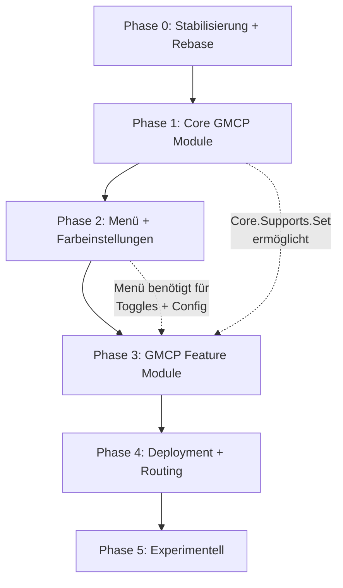
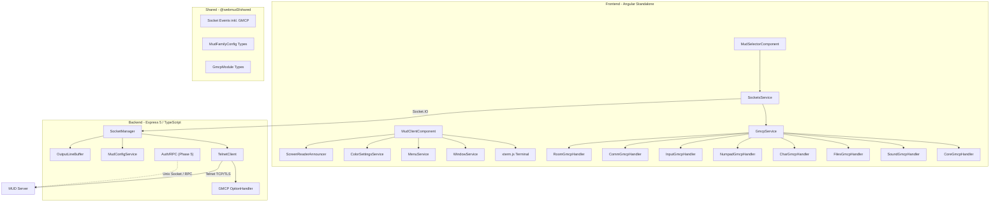
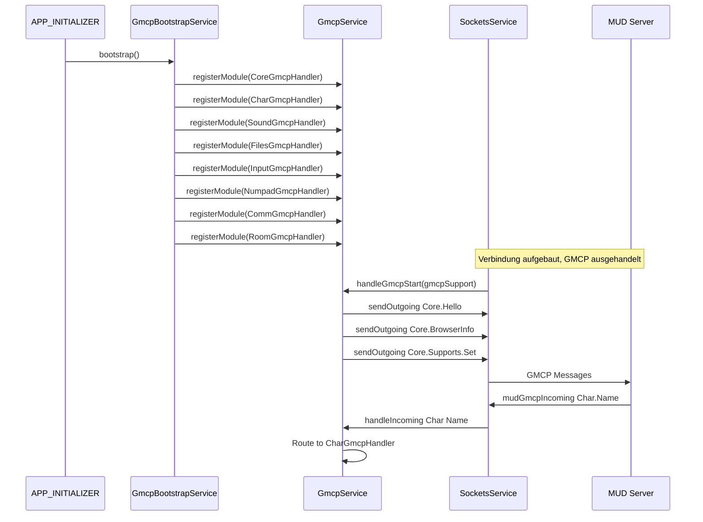
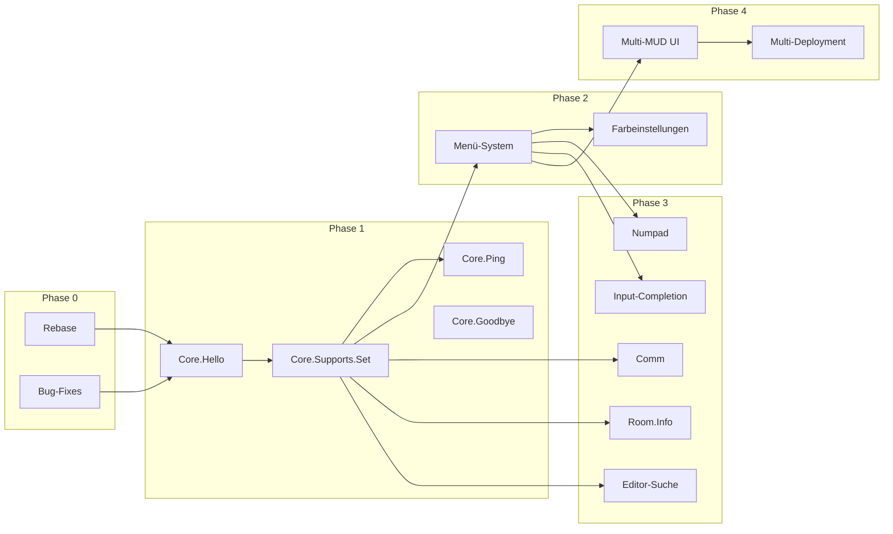

# WebMud3 Migrationsplan V3: Feature-Completion u3 (Target) mit u1 (Master)

## 1. Kontext

Die **Zielarchitektur** ist `u3_webmud3_target` (Branch `migrate/p3-gmcp`), ein teilweise migrierter Stand auf Basis von `u2_webmud3_develop` (PR #165) plus 15 eigene Migrations-Commits. Der **Feature-Spender** ist `u1_webmud3_master` (V0.6.2), der zahlreiche Features enthält, die in u3 noch fehlen.

Dieser Plan baut auf **MIGRATION_V2** (u1 → u2) auf und adressiert die **verbleibende Feature-Lücke** zwischen u1 und u3 in 6 Phasen.

### 1.1 Technologische Grundlagen der Zielarchitektur (u3)

| Aspekt                 | u3 (Target – Ziel)                            |
|------------------------|------------------------------------------------|
| **Backend-Sprache**    | TypeScript (strict), ES Modules                |
| **Projekt-Struktur**   | npm Workspaces Monorepo (shared/backend/frontend) |
| **Shared-Paket**       | `@webmud3/shared` – typisierte Socket-Events + GMCP-Typen |
| **Angular-Stil**       | Standalone Components, `inject()` statt Constructor DI |
| **Terminal-Rendering**  | xterm.js mit FitAddon, ClipboardAddon, AttachAddon |
| **UI-Framework**       | Eigenes SCSS (kein PrimeNG), Catppuccin Mocha   |
| **Express**            | v5                                              |
| **Logging**            | Winston                                         |
| **Testing**            | Jest (Frontend + Backend), ~1.752 Test-Zeilen für neue Features |
| **CI/CD**              | GitHub Actions → Azure Web App                  |
| **Accessibility**      | Custom ARIA-Live-Region ScreenReader-Announcer   |
| **Reconnection**       | Session-Token + OutputLineBuffer-Replay          |
| **GMCP Backend**       | Vollständig (Negotiation, Forwarding, Core.BrowserInfo) |
| **GMCP Frontend**      | GmcpService mit Strategy Pattern, 3 Handler (Char, Sound, Files) |
| **Multi-MUD Backend**  | MudConfigService + REST `/api/mud-config`        |
| **Fenstersystem**      | WindowService, Drag/Resize, Parent-Child, Event-Bus |
| **Code-Editor**        | Ace Editor (ace-builds), Syntax-Highlighting      |

### 1.2 Feature-Bestand der Quellarchitektur (u1)

| Aspekt                 | u1 (Master – Quelle, V0.6.2)                 |
|------------------------|-----------------------------------------------|
| **Backend-Sprache**    | Plain JavaScript (ES6+)                       |
| **Projekt-Struktur**   | Separate Packages (kein Monorepo)             |
| **Angular-Stil**       | NgModules                                     |
| **Terminal-Rendering**  | HTML-Spans mit eigenem AnsiService            |
| **UI-Framework**       | PrimeNG (Nora Theme)                          |
| **Express**            | v4                                            |
| **GMCP-Support**       | Umfangreich (15+ Module)                      |
| **Code-Editor**        | Ace Editor (37 Themes) + Suchen & Ersetzen    |
| **Fenster-System**     | Eigenes Draggable/Resizable                   |
| **Menü-System**        | PrimeNG Menubar, 3-Level, dynamisch           |
| **Numpad/Keypad**      | MUD-synchron, Modifier, visuelles Widget      |
| **Farbeinstellungen**  | Invertierung, B/W, Monochrom, Echo-Farbe      |
| **Tab-Completion**     | GMCP Input.Complete (Text/Choice/None)        |
| **Auth/RPC**           | REST Login + Unix-Socket RPC (experimentell)  |
| **Multi-Deployment**   | 5+ Environment-Configs + Docker Compose       |

---

## 2. Analyse der Feature-Lücken

### 2.1 Bereits migrierte Features (kein Handlungsbedarf)

| Feature | u1 (Master) | u3 (Target) | Migrations-Commit |
|---------|-------------|-------------|-------------------|
| GMCP-Protokoll Backend | `mudSocket.js` | `handle-gmcp-option.ts` + TelnetClient | #2, #14, #15 |
| GMCP Socket-Events | Nicht typisiert | `@webmud3/shared` GMCP-Typen | #3 |
| Multi-MUD Backend | `server.js` + `mud_config.json` | MudConfigService + REST-API | #5 |
| GMCP Frontend Core | `gmcp.service.ts` | GmcpService + Strategy Pattern | #4 |
| Fenstersystem | `window.service.ts` | WindowService + Components | #6 |
| Sound-System | UNItopia-Service | SoundGmcpHandler | #8 |
| Datei-Browser + Editor | `files.service.ts` + Modeless | FilesGmcpHandler + ACE | #7 |
| Char-Statistiken | `mud-signals.ts` | CharGmcpHandler + Statusbar | #10 |
| Inventar-Anzeige | `inventory/` Widget | InventoryComponent | #11 |
| Core.BrowserInfo | `sockets-config.ts` | extractRealIp + SocketManager | #9 |

### 2.2 Noch zu migrierende Features

| Feature | u1 (Master) | u3 (Target) | Aufwand | Phase |
|---------|-------------|-------------|---------|-------|
| Core.Hello (Client-ID) | Automatisch bei GMCP-Start | **Fehlt** | Niedrig | 1 |
| Core.Supports.Set (Init) | Automatisch nach Hello | **Fehlt** (nur Add/Remove für Sound) | Niedrig | 1 |
| Core.Ping (Keep-Alive) | Toggle-Visualisierung | **Fehlt** | Niedrig | 1 |
| Core.Goodbye (Logoff) | Empfang (Cleanup fehlt auch in u1) | **Fehlt** | Niedrig | 1 |
| Menü-System | PrimeNG Menubar, 3-Level | **Fehlt** | Mittel | 2 |
| Farbeinstellungen | Invertierung, B/W, Farben aus | **Fehlt** (nur xterm-Theme) | Mittel | 2 |
| Input-Completion | Tab → CompleteText/Choice/None | **Fehlt** | Mittel | 3 |
| Numpad/Keypad | MUD-synchron, Modifier, Widget | **Fehlt** (Aktivierung vorhanden) | Mittel | 3 |
| Comm-Module | Say/Soul/Tell als Output | **Fehlt** | Niedrig | 3 |
| Room.Info | Name, Domain, Exits | **Fehlt** | Niedrig | 3 |
| Editor-Suche | EditorSearchComponent | **Fehlt** (ACE-intern via Ctrl+F) | Niedrig | 3 |
| Multi-MUD Frontend UI | NonPortal Landing-Pages | **Fehlt** (Backend-API vorhanden) | Mittel | 4 |
| Multi-Deployment | 5+ Environments, Docker | **Fehlt** (2 Environments) | Niedrig | 4 |
| Auth/RPC | REST + RPC + LDJ-Client | **Fehlt** (Cookie-Session existiert) | Mittel | 5 |
| mdconn Microservice | LDJ über Unix-Socket | **Fehlt** | Niedrig | 5 |

### 2.3 Fehlende develop-Features (Rebase nötig)

| Feature | develop PR | Status in u3 |
|---------|------------|-------------|
| Reconnect-Fix (`forceNewSession`, Transport-Fallback) | PR #170 | **Fehlt** |
| Cancelable Screenreader (Structured Output, Echo-Suppression) | PR #172 | **Fehlt** |
| WCAG AAA Web-Colors (`minimumContrastRatio: 7`) | PR #162 | **Fehlt** |
| Docker Local Test Setup | PR #173 | **Fehlt** |

---

## 3. Migrationsprinzipien

Alle Prinzipien aus MIGRATION_V2 gelten weiterhin:

1. **Keine Rückschritte**: Accessibility (Screen Reader), TypeScript Strict, xterm.js, Standalone Components, Session-Token-Reconnection bleiben erhalten.
2. **Typisierung**: Alle migrierten Features müssen vollständig typisiert sein (kein `any`).
3. **Shared-First**: Neue Socket-Events und Typen immer zuerst in `@webmud3/shared` definieren.
4. **Strategy Pattern statt Hardcoding**: MUD-Familien-spezifisches Verhalten über austauschbare Handler, nicht über `if (family === 'unitopia')`.
5. **Lazy Loading**: GMCP-Feature-Module nur laden wenn aktiviert.
6. **Tests**: Jeder neue Handler/Service braucht Unit-Tests (Jest).
7. **Barrierefreiheit**: Alle neuen UI-Elemente (Fenster, Menüs, Dialoge) müssen ARIA-Attribute und Keyboard-Navigation unterstützen.

Zusätzlich für V3:

8. **Rebase-First**: Vor neuen Features den develop-HEAD einholen (Phase 0).
9. **Bestehende Bugs zuerst**: Bekannte Probleme aus U3_ANALYSIS.md fixen bevor neue Features aufgesetzt werden.
10. **GmcpBootstrapService erweitern**: Neue Handler werden über den bestehenden Bootstrap-Mechanismus registriert.

---

## 4. Migrationsstruktur (6 Phasen)

Die Migration wird in **6 Phasen** organisiert, geordnet nach Abhängigkeiten:



---

### Phase 0: Stabilisierung und Rebase auf develop HEAD

Schafft eine saubere Basis für alle weiteren Phasen.

#### 0.1 Rebase auf develop HEAD

**Ziel:** Die 4 fehlenden PRs aus dem develop-Branch in den Migrations-Branch integrieren.

**Fehlende PRs:**

| PR | Feature | Auswirkung auf u3 |
|----|---------|-------------------|
| #170 | Reconnect-Fix: `forceNewSession`, Transport `websocket` + `polling` | SocketsService muss erweitert werden |
| #172 | Cancelable Screenreader: Structured Output, Echo-Suppression | Neue Accessibility-Features |
| #162 | WCAG AAA Web-Colors: `minimumContrastRatio: 7` | Farbkontrast-Verbesserung, relevant für Phase 2.2 |
| #173 | Docker Local Test Setup | Neues Dockerfile für lokale Entwicklung |

**Strategie:** Cherry-Pick oder Rebase der 4 PRs. Bei Konflikten mit den 15 Migrations-Commits manuelle Resolution nötig, insbesondere in:
- `frontend/src/app/features/sockets/sockets.service.ts` (PR #170 vs. GMCP-Erweiterungen)
- `frontend/src/app/features/terminal/` (PR #172 vs. bestehende Terminal-Integration)

#### 0.2 Bekannte Bugs fixen

**Bug 1 – Files Save-Workflow (toter Code):**

- **Datei:** `u3_webmud3_target/frontend/src/app/features/gmcp-files/files-gmcp-handler.ts`
- **Problem:** `completeSave()` wird nie direkt aufgerufen; der Save-Workflow nutzt den Re-Open-via-`handleFilesUrl()`-Mechanismus
- **Fix:** `completeSave()` entfernen oder korrekt in den Save-Workflow einbinden

**Bug 2 – WindowAction Missbrauch:**

- **Datei:** `u3_webmud3_target/frontend/src/app/features/windows/window-config.ts`
- **Problem:** `WindowService.updateData()` nutzt `WindowAction.Resize` als "data changed"-Signal
- **Fix:** Neues Enum-Member `WindowAction.DataChanged` einführen:

```typescript
export enum WindowAction {
  Focus = 'focus',
  Hide = 'hide',
  Save = 'save',
  Cancel = 'cancel',
  SaveAndClose = 'saveAndClose',
  WinError = 'winError',
  Resize = 'resize',
  DataChanged = 'dataChanged',  // NEU
}
```

**Bug 3 – GMCP.md veraltet:**

- **Problem:** `GMCP.md` zeigt alle `Char.*`-Messages als nicht implementiert, obwohl sie in u3 fertig sind
- **Fix:** Dokumentation aktualisieren (Checkboxen setzen)

---

### Phase 1: Core GMCP Module

**Ziel:** Die fehlenden Core-GMCP-Handshake-Mechanismen implementieren, die in u1 vorhanden sind aber in u3 fehlen. Diese sind Voraussetzung für korrekte MUD-Kommunikation.

#### 1.1 Core.Hello (Client-Identifikation)

**Referenz:** `u1_webmud3_master/frontend/src/app/shared/sockets-config.ts` (Zeile 163–166)

In u1 wird bei GMCP-Start automatisch gesendet:

```typescript
other.sendGMCP(id, 'Core', 'Hello', {
  client: ioPlatform.srvcfg.getWebmudName(),
  version: ioPlatform.srvcfg.getWebmudVersion(),
});
```

**Aufgaben:**

- In `GmcpService.handleGmcpStart()` nach Emission von `gmcpStart$` automatisch `Core.Hello` senden
- Kein eigener Handler nötig — direkt über `sendOutgoing('Core', 'Hello', { client, version })`
- Client-Name und Version aus `environment.ts` oder Konstante beziehen
- MUD antwortet ebenfalls mit `Core.Hello { name: "UNItopia" }` — dieses Event loggen (Info-Level)

**Schnittstelle:**

```typescript
// In GmcpService.handleGmcpStart():
this.sendOutgoing('Core', 'Hello', {
  client: 'WebMud3',
  version: 'v0.7',  // oder aus Environment
});
```

#### 1.2 Core.Supports.Set (Modul-Aktivierung)

**Referenz:** `u1_webmud3_master/frontend/src/app/shared/sockets-config.ts` (Zeile 168–175)

In u1 werden nach `Core.Hello` alle unterstützten Module per `Core.Supports.Set` an das MUD gemeldet. In u3 wird nur `Core.Supports.Add/Remove` für den Sound-Toggle genutzt, aber das initiale `Set` fehlt.

**Aufgaben:**

- In `GmcpService.handleGmcpStart()` nach `Core.Hello` alle registrierten Module sammeln:

```typescript
// Alle registrierten Module als "ModuleName Version" Array
const supportList = Array.from(this.moduleRegistry.values())
  .map(handler => `${handler.moduleName} ${handler.version}`);

this.sendOutgoing('Core', 'Supports.Set', supportList);
// z.B. ["Char 1", "Char.Items 1", "Sound 1", "Files 1"]
```

- Reihenfolge: `Core.Hello` → `Core.BrowserInfo` → `Core.Supports.Set`
- Nach `Supports.Set` kann das MUD sofort GMCP-Messages für die aktivierten Module senden

#### 1.3 Core.Ping (Keep-Alive mit Latenz)

**Referenz:** `u1_webmud3_master/frontend/src/app/mud/mud-signals.ts` – `case 'Core.Ping'`

In u1 wird bei Empfang eines `Core.Ping` ein visueller Toggle gesetzt (`other.togglePing = !other.togglePing`).

**Aufgaben:**

- Neues Feature-Verzeichnis: `frontend/src/app/features/gmcp-core/`
- `CoreGmcpHandler` erstellen, implementiert `GmcpModuleHandler`:

```typescript
@Injectable({ providedIn: 'root' })
export class CoreGmcpHandler implements GmcpModuleHandler {
  readonly moduleName = 'Core';
  readonly version = '1';

  /** Observable für Ping-Toggle (visueller Indikator) */
  public readonly pingToggle$ = new BehaviorSubject<boolean>(false);

  /** Letzte gemessene Latenz in ms */
  public readonly latency$ = new BehaviorSubject<number | null>(null);

  private lastPingSent = 0;

  handleMessage(message: string, data: unknown): void {
    switch (message) {
      case 'Ping':
        this.handlePing();
        break;
      case 'Goodbye':
        this.handleGoodbye(data);
        break;
    }
  }

  private handlePing(): void {
    // Latenz berechnen falls wir den Ping initiiert haben
    if (this.lastPingSent > 0) {
      this.latency$.next(Date.now() - this.lastPingSent);
      this.lastPingSent = 0;
    }
    // Visueller Toggle (wie u1)
    this.pingToggle$.next(!this.pingToggle$.value);
    // Pong zurücksenden
    this.sendFunction?.('Core', 'Ping', {});
  }
}
```

- Visueller Indikator: Ping-Toggle als kleines Icon in Statusbar oder Menüleiste
- In `GmcpBootstrapService` registrieren

#### 1.4 Core.Goodbye (Logoff-Handling)

**Referenz:** u1 empfängt `Core.Goodbye`, aber Resource-Handling fehlt auch dort (TODO in u1, `GMCP.md`)

**Aufgaben:**

- In `CoreGmcpHandler.handleMessage('Goodbye', data)`:
  - Logoff-Nachricht im Terminal anzeigen (z.B. `[MUD meldet Abmeldung]`)
  - GMCP-State zurücksetzen über `GmcpService.reset()`
  - Bestehende Fenster schließen (WindowService)
  - CharacterData zurücksetzen
- **Hinweis:** Auch in u1 ist dieses Feature nur teilweise implementiert. Hier die erste vollständige Implementierung.

---

### Phase 2: Menü-System und Farbeinstellungen

#### 2.1 Menü-System

**Ziel:** Dynamisches hierarchisches Menü für MUD-Steuerung und Feature-Zugriff.

**Referenz:**
- `u1_webmud3_master/frontend/src/app/menu/menu.service.ts` – 3-Level-Hierarchie, dynamische Items
- `u1_webmud3_master/frontend/src/app/menu/one-menu.ts` – `MenuType`, Callback-System
- `u1_webmud3_master/frontend/src/app/menu/main-menu/main-menu.component.ts` – PrimeNG Menubar

**Ziel-Verzeichnis:** `frontend/src/app/features/menu/`

**Aufgaben:**

- `MenuService` als Injectable (`providedIn: 'root'`):
  - Typisiertes Menü-Modell (ohne PrimeNG — eigenes SCSS):

```typescript
export interface MenuItem {
  id: string;
  label: string;
  icon?: string;
  disabled?: boolean;
  visible?: boolean;
  separator?: boolean;
  command?: (event: MenuEvent) => void;
  children?: MenuItem[];
}

export interface MenuEvent {
  item: MenuItem;
  originalEvent?: Event;
}

@Injectable({ providedIn: 'root' })
export class MenuService {
  private readonly menuItems$ = new BehaviorSubject<MenuItem[]>([]);

  /** Registriert/aktualisiert einen Menüpunkt */
  registerItem(parentId: string | null, item: MenuItem): void { ... }

  /** Entfernt einen Menüpunkt */
  removeItem(itemId: string): void { ... }

  /** Observable der aktuellen Menüstruktur */
  get items$(): Observable<MenuItem[]> { return this.menuItems$.asObservable(); }
}
```

  - 3-Level-Hierarchie: Hauptmenü → Untermenü → Sub-Untermenü
  - Dynamische Items:
    - **MUD**: Connect (MUD-Liste aus `/api/mud-config`), Disconnect
    - **Ansicht**: Scroll-Lock Toggle, Farbeinstellungen (→ Phase 2.2)
    - **GMCP**: Sound an/aus, Numpad-Config (→ Phase 3.2)
    - **Fenster**: Liste offener Fenster
  - GMCP-Module können eigene Menüpunkte registrieren via `GmcpModuleHandler.getMenuItems()`

- `MenuBarComponent` (Standalone):
  - Horizontale Leiste am oberen Bildschirmrand
  - Eigenes SCSS mit Catppuccin Mocha Farbschema (konsistent zu WindowComponent)
  - Keyboard-Navigation: Arrow-Keys horizontal/vertikal, Enter zum Öffnen, Escape zum Schließen
  - ARIA: `role="menubar"`, `role="menu"`, `role="menuitem"`, `aria-expanded`, `aria-haspopup`
  - Responsive: Hamburger-Menü auf schmalen Bildschirmen

- `MenuDropdownComponent` (Standalone):
  - Dropdown-Panel für Untermenüs
  - Positionierung relativ zum Parent-Item
  - Klick-außerhalb-Schließen via `@HostListener('document:click')`

- Integration in `app.component.html`:
  - `<app-menu-bar>` oberhalb des Terminal-Bereichs
  - Layout: MenuBar → Terminal + Statusbar → WindowContainer

**Schnittstelle zu GMCP-Modulen:**

```typescript
// In GmcpModuleHandler (bestehendes Interface erweitern):
export interface GmcpModuleHandler {
  readonly moduleName: string;
  readonly version: string;
  handleMessage(message: string, data: unknown): void;
  getMenuItems?(): MenuItem[];  // Optional: Menüpunkte für dieses Modul
  dispose?(): void;
}
```

#### 2.2 Farbeinstellungen für xterm.js

**Ziel:** Benutzer können Terminal-Farben anpassen wie in u1.

**Referenz:**
- `u1_webmud3_master/frontend/src/app/settings/color-settings/color-settings.component.ts` – PrimeNG DynamicDialog
- `u1_webmud3_master/frontend/src/app/mud/color-settings.ts` – Farb-Invertierung, B/W, Monochrom

**Ziel-Verzeichnis:** `frontend/src/app/features/settings/`

**Aufgaben:**

- `ColorSettingsService` als Injectable:

```typescript
export interface ColorSettings {
  invertColors: boolean;       // Alle Farben invertieren
  blackOnWhite: boolean;       // Schwarz/Weiß tauschen (helle Umgebungen)
  disableColors: boolean;      // Monochromer Modus
  localEchoColor: string;     // Farbe für lokales Echo (Standard: '#a8ff00')
}

@Injectable({ providedIn: 'root' })
export class ColorSettingsService {
  private readonly settings$ = new BehaviorSubject<ColorSettings>(this.loadFromStorage());

  /** Speichert Einstellungen in localStorage (statt Base64-Cookie wie u1) */
  save(settings: ColorSettings): void { ... }

  /** Generiert xterm.js Theme aus aktuellen Einstellungen */
  getXtermTheme(): ITheme { ... }
}
```

- xterm.js Theme-API Integration:
  - `terminal.options.theme = { background, foreground, cursor, selection, ... }`
  - 16 ANSI-Farben einzeln überschreibbar
  - Bei `invertColors`: Alle Farbwerte invertieren
  - Bei `blackOnWhite`: `background = '#ffffff'`, `foreground = '#000000'`
  - Bei `disableColors`: Alle Farben auf Schwarz/Weiß-Palette setzen
  - WCAG: Kompatibel mit PR #162 (`minimumContrastRatio: 7`)

- `ColorSettingsComponent` (Standalone):
  - Dialog/Panel, über Menü erreichbar (Phase 2.1)
  - Toggle-Switches für Invertierung, B/W, Farben aus
  - Farbwähler für Local-Echo-Farbe
  - Live-Vorschau der Terminal-Farben
  - ARIA: Labels für alle Eingabefelder, `role="dialog"`

---

### Phase 3: GMCP-Feature-Module

Jedes GMCP-Modul wird als eigenständiges Angular Feature implementiert, das das bestehende `GmcpModuleHandler`-Interface aus `frontend/src/app/features/gmcp/gmcp-module-handler.ts` implementiert. Neue Handler werden in `GmcpBootstrapService` registriert.

#### 3.1 Input-Completion (Tab-Vervollständigung)

**Ziel:** Tab-Vervollständigung über GMCP, wie in u1 implementiert.

**Referenz:**
- `u1_webmud3_master/frontend/src/app/mud/mud-signals.ts` (Zeile 166–175) – `Input.CompleteText`, `Input.CompleteChoice`, `Input.CompleteNone`
- `u1_webmud3_master/frontend/src/app/shared/sockets-config.ts` (Zeile 224–246) – GMCP-Signal-Routing für Input-Module

**Ziel-Verzeichnis:** `frontend/src/app/features/gmcp-input/`

**Aufgaben:**

- `InputGmcpHandler` implementiert `GmcpModuleHandler`:

```typescript
@Injectable({ providedIn: 'root' })
export class InputGmcpHandler implements GmcpModuleHandler {
  readonly moduleName = 'Input';
  readonly version = '1';

  /** Letzte Completion-Antwort */
  public readonly completionResult$ = new Subject<CompletionResult>();

  handleMessage(message: string, data: unknown): void {
    switch (message) {
      case 'CompleteText':
        this.completionResult$.next({ type: 'text', value: data as string });
        break;
      case 'CompleteChoice':
        this.completionResult$.next({ type: 'choice', options: data as string[][] });
        break;
      case 'CompleteNone':
        this.completionResult$.next({ type: 'none' });
        break;
    }
  }
}

export interface CompletionResult {
  type: 'text' | 'choice' | 'none';
  value?: string;
  options?: string[][];
}
```

- Integration in `MudInputController` (`frontend/src/app/features/terminal/mud-input.controller.ts`):
  - Tab-Taste abfangen → aktuelles Wort extrahieren → `Input.Complete` an MUD senden:
    ```typescript
    gmcpService.sendOutgoing('Input', 'Complete', { text: currentWord });
    ```
  - Bei `CompleteText`: Aktuelles Wort im Input-Buffer ersetzen
  - Bei `CompleteChoice`: Auswahlliste anzeigen (→ Completion-Overlay)
  - Bei `CompleteNone`: Optional Beep oder keine Aktion

- `CompletionOverlayComponent` (Standalone):
  - Dropdown-Liste bei `Choice`-Response
  - Positionierung relativ zur Cursor-Position im Terminal
  - Keyboard-Navigation (Arrow-Keys, Enter zum Auswählen, Escape zum Schließen)
  - ARIA: `role="listbox"`, `role="option"`, `aria-activedescendant`

- In `GmcpBootstrapService` registrieren

#### 3.2 Numpad/Keypad

**Ziel:** MUD-synchronisierte Tastenbelegung mit visuellem Numpad-Widget.

**Referenz:**
- `u1_webmud3_master/frontend/src/app/shared/keypad-data.ts` – `OneKeypadData`, `KeypadData` Klassen (untypisiert, `any`)
- `u1_webmud3_master/frontend/src/app/modeless/keypad/keypad.component.ts` – Visuelles Keypad-Widget (PrimeNG DynamicDialog)

**Ziel-Verzeichnis:** `frontend/src/app/features/gmcp-numpad/`

**Aufgaben:**

- Typisiertes `KeypadData`-Datenmodell (Map statt `any` wie in u1):

```typescript
export interface OneKeypadData {
  prefix: string;
  keys: Map<string, string>;  // Taste → Befehl
}

export interface KeypadData {
  levels: Map<string, OneKeypadData>;
  currentLevel: string;
}
```

- `NumpadGmcpHandler` implementiert `GmcpModuleHandler`:

```typescript
@Injectable({ providedIn: 'root' })
export class NumpadGmcpHandler implements GmcpModuleHandler {
  readonly moduleName = 'Numpad';
  readonly version = '1';

  public readonly keypadData$ = new BehaviorSubject<KeypadData | null>(null);

  handleMessage(message: string, data: unknown): void {
    switch (message) {
      case 'SendLevel':
        // MUD sendet Tastenbelegung für eine Ebene
        this.handleSendLevel(data as NumpadLevelPayload);
        break;
    }
  }

  /** Client sendet geänderte Belegung zurück ans MUD */
  sendUpdate(level: string, key: string, value: string): void {
    this.sendFunction?.('Numpad', 'Update', { level, key, value });
  }

  /** Client fordert alle Ebenen an */
  requestAll(): void {
    this.sendFunction?.('Numpad', 'GetAll', {});
  }
}
```

- Modifier-Support: Shift, Ctrl, Alt, Meta + Numpad-Tasten + F-Tasten
  - Compound-Key-Format: `"prefix|key"` (z.B. `"shift|Numpad7"` → "nordwesten")
  - `getCompoundKey(modifiers: string): string` wie in u1

- `KeypadComponent` (Standalone):
  - Visuelles anklickbares Numpad-Widget als Modeless Window (via WindowService)
  - 3x3 Grid für Richtungen (NW, N, NE, W, center, E, SW, S, SE)
  - Klick → Befehl an MUD senden
  - Anzeige der aktuellen Belegung pro Taste
  - ARIA: `role="grid"`, `aria-label` pro Taste

- `KeypadConfigComponent` (Standalone):
  - Konfigurationsdialog im Fenstersystem (Parent: KeypadComponent)
  - Ebene auswählen, Tasten-Zuordnung bearbeiten
  - Speichern → `Numpad.Update` an MUD

- Integration in `MudInputController`:
  - Numpad-Tasten (Numpad0–Numpad9, NumpadDecimal, etc.) und F-Tasten abfangen
  - Modifier-Erkennung (Shift/Ctrl/Alt/Meta)
  - Compound-Key-Lookup in `KeypadData` → Befehl an MUD senden
  - Tastendruck nicht an Terminal weiterleiten wenn Mapping existiert

- Aktivierung: Wird bei Wizard-Login via `Core.Supports.Add ['Numpad 1']` aktiviert (Logik in `CharGmcpHandler` bei Wizard-Erkennung über `Char.Name` bereits vorhanden)

#### 3.3 Kommunikations-Module (Comm)

**Ziel:** GMCP-Kommunikationskanäle wie in u1 unterstützen.

**Referenz:** u1 hat `Comm.Say`, `Comm.Soul`, `Comm.Tell` als GMCP-Signale, die als regulärer MUD-Output durchgereicht werden.

**Ziel-Verzeichnis:** `frontend/src/app/features/gmcp-comm/`

**Aufgaben:**

- `CommGmcpHandler` implementiert `GmcpModuleHandler`:

```typescript
@Injectable({ providedIn: 'root' })
export class CommGmcpHandler implements GmcpModuleHandler {
  readonly moduleName = 'Comm';
  readonly version = '1';

  /** Observable für Kommunikations-Messages */
  public readonly commMessage$ = new Subject<CommMessage>();

  handleMessage(message: string, data: unknown): void {
    switch (message) {
      case 'Say':
      case 'Soul':
      case 'Tell':
        this.commMessage$.next({ type: message, data });
        break;
    }
  }
}
```

- **Minimal-Implementierung**: Comm-Messages werden als regulärer MUD-Output durchgereicht (wie in u1)
- **Optional (Erweiterung)**: Separates Kommunikations-Panel als Modeless Window mit gefilterten Nachrichten
- In `GmcpBootstrapService` registrieren

#### 3.4 Room.Info

**Ziel:** Raum-Informationen vom MUD empfangen und anzeigen.

**Referenz:** u1 empfängt `Room.Info` mit Name, Domain und Exits.

**Aufgaben:**

- In `CoreGmcpHandler` (aus Phase 1.3) erweitern oder eigenen `RoomGmcpHandler`:

```typescript
export interface RoomInfo {
  name?: string;
  domain?: string;
  exits?: string[];
}
```

- **Minimal**: Raum-Name im Browser-Titel anzeigen (`document.title = roomName + ' - WebMud3'`)
- **Optional**: Exit-Buttons als anklickbare Links unter dem Terminal
- In `GmcpBootstrapService` registrieren (wenn eigener Handler)

#### 3.5 Editor-Suche (Suchen & Ersetzen)

**Ziel:** Suchen & Ersetzen im Code-Editor.

**Referenz:** `u1_webmud3_master/frontend/src/app/settings/editor-search/editor-search.component.ts` – eigenes Fenster für Suchen & Ersetzen

**Aufgaben:**

- **Option A (empfohlen)**: ACE-eigene Suche nutzen (Ctrl+F / Ctrl+H) — bereits in `ace-builds` enthalten, nur sicherstellen dass die Keybindings nicht vom Terminal abgefangen werden
- **Option B**: Eigenes `EditorSearchComponent` als Child-Fenster des Editors (wie in u1), das über ACE's Search-API (`editor.find()`, `editor.replace()`) arbeitet
- Falls Option B: Integration im Fenstersystem als Parent-Child (Editor → EditorSearch)

---

### Phase 4: Multi-MUD Frontend und Deployment

#### 4.1 Multi-MUD-Routing im Frontend

**Ziel:** Verschiedene MUDs über URL-Pfade auswählbar, wie in u1 mit dynamischen Routen.

**Status:** Backend-API (`GET /api/mud-config`) existiert bereits in u3, aber das Frontend hat keine Auswahlkomponente und übergibt keinen `mudId`-Parameter.

**Referenz:** `u1_webmud3_master/frontend/src/app/nonportal/` – Landing-Pages pro MUD (UNItopia, Orbit, Seifenblase)

**Aufgaben:**

- `MudSelectorComponent` (Standalone):
  - Landing-Page mit MUD-Auswahl
  - Lädt MUD-Liste von `/api/mud-config` beim Start
  - Zeigt Name, Beschreibung, Playerlevel pro MUD
  - Klick → Navigation zu `/:mudId`
  - ARIA: `role="list"`, Keyboard-Navigation

- Angular Router konfigurieren:
  - Parametrisierte Route: `/:mudId` → `MudClientComponent`
  - Default-Route: `'/'` → `MudSelectorComponent` oder direkt zum Standard-MUD aus Config
  - `mud_config.json` Routes: `"/"` → UNItopia, `"/orbit"` → Orbit, etc.

- `SocketsService.mudConnect()` erweitern:
  - `mudId` aus ActivatedRoute-Parameter übergeben:
    ```typescript
    socket.emit('mudConnect', viewport, sessionToken, mudId);
    ```

- `MudClientComponent` erweitern:
  - `mudId` aus Route-Parameter lesen und an `SocketsService` weiterreichen

#### 4.2 Multi-Deployment-Konfiguration

**Ziel:** Verschiedene Deployment-Szenarien unterstützen wie in u1.

**Referenz:** `u1_webmud3_master/frontend/src/environments/` (5+ Environment-Files)

**Aufgaben:**

- Zusätzliche Environment-Files:
  - `frontend/src/environments/environment.prod.sb.ts` (Seifenblase)
  - `frontend/src/environments/environment.prod.uni.ts` (UNItopia Produktion)

- `ServerConfigService` erweitern (oder neu erstellen):
  - URL-basierte Backend-Erkennung:
    - UNItopia Produktion (`/webmud3/`) → `/mysocket.io`
    - UNItopia Test (`/webmud3test/`) → `/mysocket-test.io`
    - Seifenblase (`/webmud3/`) → `/sbsocket.io`
    - Lokal → `/socket.io`
  - Referenz: `u1_webmud3_master/frontend/src/app/shared/server-config.service.ts`

- Docker Compose Varianten:
  - Lokales Deployment (`w3_docker_compose_local.yml`)
  - Produktion UNItopia (`w3_docker_compose.yml`)
  - Seifenblase (`w3_docker_compose_sb.yml`)
  - Mit Apache Reverse-Proxy (`w3_docker_compose_with_apache.yml`)
  - Secret-Management (`w3_docker_compose_secret.yml`)

- `angular.json`: File-Replacements für zusätzliche Build-Konfigurationen

---

### Phase 5: Experimentelle Features (optional)

#### 5.1 Auth/RPC

**Ziel:** Experimentelle Authentifizierung gegen den MUD-Server, wie in u1 vorhanden.

**Referenz:** `u1_webmud3_master/backend/mudrpc/` – LDJ-Client, MudRpc, RpcClient, AuthController

**Aufgaben:**

- REST-Auth-Routes in TypeScript portieren:
  - `POST /api/auth/login` → RPC `mud.password` Validierung
  - `POST /api/auth/logout` → Session beenden
  - `GET /api/auth/loggedon` → Status abfragen

- `LdjClient` (Line-Delimited JSON) in TypeScript portieren:
  - TCP/Unix-Socket-Verbindung zum MUD
  - Zeilenweise JSON-Nachrichten senden/empfangen

- `MudRpc` in TypeScript portieren:
  - Request/Response-Protokoll mit ID-basiertem Caching
  - Timeout-Handling für ausstehende Requests

- `RpcClient` mit Lazy-Connection und Auto-Reconnect

- Cookie-Session-Middleware reaktivieren:
  - `use-cookie-session.ts` existiert bereits in u2/u3 (auskommentiert)
  - Secret-Key aus Docker Secrets laden

- GMCP `Char.Login`:
  - JWT-Token-basiertes Auto-Login (konzeptionell aus u1)
  - Bei vorhandener Session → automatischer Login über GMCP

#### 5.2 mdconn Microservice

**Ziel:** RPC-Bridge zum MUD-Server über Unix-Socket.

**Referenz:** `u1_webmud3_master/mdconn/` – LDJ-Protokoll über Unix-Socket

**Aufgaben:**

- TypeScript-Portierung des LDJ-Protokolls (analog zu Phase 5.1)
- Eigenes `mdconn/`-Paket im Monorepo oder separates Repository
- Docker Compose Integration (eigenes Dockerfile, IPC-Mount)
- Dokumentation der IPC-Schnittstelle

---

## 5. Architektur-Diagramm: Zielzustand nach V3



### GMCP-Modul-Registrierung (Bootstrap-Flow)



---

## 6. Empfohlene Reihenfolge und Priorisierung

| Priorität | Phase | Begründung |
|-----------|-------|------------|
| **Kritisch** | 0.1 (Rebase auf develop HEAD) | Basis für alle weiteren Arbeiten |
| **Kritisch** | 0.2 (Bug-Fixes) | Sauberer Ausgangszustand |
| **Hoch** | 1.1 + 1.2 (Core.Hello + Supports.Set) | MUD erwartet korrekte Handshake-Sequenz |
| **Hoch** | 2.1 (Menü-System) | Zentrales UX-Element, Voraussetzung für Toggles/Config |
| **Mittel** | 1.3 (Core.Ping) | Keep-Alive, verbessert Stabilität |
| **Mittel** | 2.2 (Farbeinstellungen) | Wichtig für Barrierefreiheit |
| **Mittel** | 3.1 (Input-Completion) | Wichtiges Komfort-Feature für Power-User |
| **Mittel** | 3.2 (Numpad/Keypad) | Komfort-Feature für Wizard-User |
| **Niedrig** | 1.4 (Core.Goodbye) | Robustheit, aber selten ausgelöst |
| **Niedrig** | 3.3 (Comm-Module) | Minimal: Durchreichen reicht |
| **Niedrig** | 3.4 (Room.Info) | Nice-to-have (Browser-Titel) |
| **Niedrig** | 3.5 (Editor-Suche) | ACE-eigene Suche funktioniert bereits |
| **Niedrig** | 4.1 (Multi-MUD Frontend) | Erst für Produktivbetrieb |
| **Niedrig** | 4.2 (Multi-Deployment) | Erst für Produktivbetrieb |
| **Optional** | 5.1 (Auth/RPC) | Experimentell, auch in u1 unvollständig |
| **Optional** | 5.2 (mdconn) | Experimentell |

---

## 7. Aufwandsschätzung

| Phase | Geschätzter Aufwand | Beschreibung |
|-------|---------------------|--------------|
| Phase 0 | 1–2 Wochen | Rebase + Bug-Fixes + Dokumentation |
| Phase 1 | 1 Woche | Core.Hello, Supports.Set, Ping, Goodbye |
| Phase 2 | 2–3 Wochen | Menü-System + Farbeinstellungen |
| Phase 3 | 3–5 Wochen | Input, Numpad, Comm, Room, Editor-Suche |
| Phase 4 | 1–2 Wochen | Multi-MUD Frontend + Multi-Deployment |
| Phase 5 | 2–4 Wochen | Auth/RPC + mdconn (optional) |
| **Gesamt** | **10–17 Wochen** | Je nach Priorisierung und Parallelisierung |

### Vergleich mit MIGRATION_V2

| | V2 (u1 → u2) | V3 (u3 Feature-Completion) |
|---|---|---|
| **Geschätzter Aufwand** | 10–20 Wochen | 10–17 Wochen |
| **Bereits erledigt durch u3** | — | Phase 1 komplett, Phase 2.1 + 3.1–3.3 teilweise |
| **Neue Arbeit** | Alles | UI-Features, GMCP-Module, Deployment |
| **Komplexeste Aufgabe** | GMCP-Infrastruktur | Menü-System + Numpad |

---

## 8. Risiken und Mitigationen

| Risiko | Auswirkung | Mitigation |
|--------|------------|------------|
| Rebase-Konflikte mit 4 develop-PRs | Merge-Aufwand, mögliche Regressionen | Sorgfältige manuelle Resolution, Tests nach jedem PR |
| Menü-System ohne PrimeNG aufwändig | Eigene Keyboard-Navigation + ARIA nötig | Angular CDK Overlay als Basis nutzen |
| Numpad-Tasten werden vom Terminal abgefangen | Keypad-Befehle kommen nicht an | `keydown`-Handler mit `preventDefault()` vor xterm.js |
| xterm.js Theme-API limitiert Farbkontrolle | Weniger flexibel als u1's HTML-Span-Rendering | Theme-API + Custom-Addon evaluieren |
| Ace Editor Keyboard-Konflikte mit Terminal | Shortcuts kollidieren (z.B. Ctrl+C, Ctrl+V) | Editor-Fenster bekommt Focus-Tracking, Terminal-Shortcuts nur bei Terminal-Fokus |
| Multi-MUD-Routing ändert App-Struktur | Breaking Change für Single-MUD-Deployment | Rückwärtskompatibel: Default-Route bleibt gleich |
| Auth/RPC-Portierung komplex (LDJ-Protokoll) | Schwer zu testen ohne MUD-Server | Mock-Server für Tests, Lazy-Loading |
| WCAG-Kompatibilität neuer UI-Elemente | Accessibility-Regression | ARIA-Attribute, Keyboard-Tests, Screenreader-Tests |

---

## 9. Referenz-Dateien

### u1 (Master) – Quellen für verbleibende Migration

| Datei/Ordner | Feature | Phase |
|---|---|---|
| `frontend/src/app/shared/sockets-config.ts` (Zeile 163–175) | Core.Hello, Core.Supports.Set, GMCP-Start-Sequenz | 1 |
| `frontend/src/app/mud/mud-signals.ts` (Zeile 166–175, 270–272) | Input.Complete, Core.Ping | 1, 3 |
| `frontend/src/app/menu/menu.service.ts` | Menü-Hierarchie, dynamische Items | 2 |
| `frontend/src/app/menu/one-menu.ts` | MenuType, Callback-System | 2 |
| `frontend/src/app/menu/main-menu/main-menu.component.ts` | PrimeNG Menubar (als Referenz) | 2 |
| `frontend/src/app/mud/color-settings.ts` | Farb-Invertierung, B/W, Monochrom | 2 |
| `frontend/src/app/settings/color-settings/color-settings.component.ts` | Farbeinstellungs-Dialog | 2 |
| `frontend/src/app/shared/keypad-data.ts` | Numpad-Datenmodell (OneKeypadData, KeypadData) | 3 |
| `frontend/src/app/modeless/keypad/keypad.component.ts` | Visuelles Keypad-Widget | 3 |
| `frontend/src/app/settings/editor-search/editor-search.component.ts` | Editor Suchen & Ersetzen | 3 |
| `frontend/src/app/nonportal/` | Landing-Pages pro MUD | 4 |
| `frontend/src/environments/` | 5+ Environment-Configs | 4 |
| `frontend/src/app/shared/server-config.service.ts` | URL-basierte Backend-Erkennung | 4 |
| `backend/mudrpc/` | Auth/RPC-System (LDJ, MudRpc, RpcClient) | 5 |
| `mdconn/` | RPC-Bridge Microservice | 5 |

### u3 (Target) – Zu erweiternde Dateien

| Datei/Ordner | Erweiterung | Phase |
|---|---|---|
| `frontend/src/app/features/gmcp/gmcp.service.ts` | + Core.Hello, + Core.Supports.Set in `handleGmcpStart()` | 1 |
| `frontend/src/app/features/gmcp/gmcp-bootstrap.service.ts` | + Registrierung neuer Handler (Core, Input, Numpad, Comm, Room) | 1, 3 |
| `frontend/src/app/features/gmcp/gmcp-module-handler.ts` | + `getMenuItems?()` Interface-Erweiterung | 2 |
| `frontend/src/app/features/windows/window-config.ts` | + `WindowAction.DataChanged` | 0 |
| `frontend/src/app/features/gmcp-files/files-gmcp-handler.ts` | Fix: Save-Workflow toter Code | 0 |
| `frontend/src/app/features/terminal/mud-input.controller.ts` | + Tab-Completion, + Numpad-Tasten | 3 |
| `frontend/src/app/features/sockets/sockets.service.ts` | + `mudId`-Parameter bei Connect | 4 |
| `frontend/src/app/app.component.html` | + `<app-menu-bar>` | 2 |
| `frontend/src/app/app.component.ts` | + MenuBarComponent Import | 2 |
| `GMCP.md` | Dokumentation aktualisieren | 0 |

### Neue Dateien (zu erstellen)

| Datei | Feature | Phase |
|---|---|---|
| `frontend/src/app/features/gmcp-core/core-gmcp-handler.ts` | Core.Ping, Core.Goodbye | 1 |
| `frontend/src/app/features/gmcp-core/core-gmcp-handler.spec.ts` | Tests | 1 |
| `frontend/src/app/features/menu/menu.service.ts` | Menü-Hierarchie | 2 |
| `frontend/src/app/features/menu/menu-bar.component.ts` | Horizontale Menüleiste | 2 |
| `frontend/src/app/features/menu/menu-dropdown.component.ts` | Dropdown-Panel | 2 |
| `frontend/src/app/features/menu/menu.service.spec.ts` | Tests | 2 |
| `frontend/src/app/features/settings/color-settings.service.ts` | Farbeinstellungs-Logik | 2 |
| `frontend/src/app/features/settings/color-settings.component.ts` | Farbeinstellungs-Dialog | 2 |
| `frontend/src/app/features/settings/color-settings.service.spec.ts` | Tests | 2 |
| `frontend/src/app/features/gmcp-input/input-gmcp-handler.ts` | Tab-Completion Handler | 3 |
| `frontend/src/app/features/gmcp-input/completion-overlay.component.ts` | Completion-Dropdown | 3 |
| `frontend/src/app/features/gmcp-input/input-gmcp-handler.spec.ts` | Tests | 3 |
| `frontend/src/app/features/gmcp-numpad/numpad-gmcp-handler.ts` | Numpad GMCP Handler | 3 |
| `frontend/src/app/features/gmcp-numpad/keypad-data.ts` | Typisiertes Datenmodell | 3 |
| `frontend/src/app/features/gmcp-numpad/keypad.component.ts` | Visuelles Numpad-Widget | 3 |
| `frontend/src/app/features/gmcp-numpad/keypad-config.component.ts` | Konfigurations-Dialog | 3 |
| `frontend/src/app/features/gmcp-numpad/numpad-gmcp-handler.spec.ts` | Tests | 3 |
| `frontend/src/app/features/gmcp-comm/comm-gmcp-handler.ts` | Comm Handler | 3 |
| `frontend/src/app/features/gmcp-comm/comm-gmcp-handler.spec.ts` | Tests | 3 |
| `frontend/src/app/features/mud-selector/mud-selector.component.ts` | MUD-Auswahl Landing-Page | 4 |
| `frontend/src/environments/environment.prod.sb.ts` | Seifenblase Env | 4 |
| `frontend/src/environments/environment.prod.uni.ts` | UNItopia Prod Env | 4 |

---

## 10. Abhängigkeitsmatrix

Die folgende Matrix zeigt, welche Phasen aufeinander aufbauen:



| Abhängigkeit | Warum? |
|---|---|
| Phase 0 → Phase 1 | Sauberer Code-Stand nötig |
| Core.Hello → Core.Supports.Set | MUD erwartet Hello vor Supports |
| Core.Supports.Set → alle GMCP-Module | Module müssen dem MUD erst gemeldet werden |
| Menü-System → Farbeinstellungen | Farbdialog wird über Menü geöffnet |
| Menü-System → Numpad-Config | Numpad-Config wird über Menü geöffnet |
| Menü-System → Input-Completion | (Schwache Abhängigkeit: Completion funktioniert auch ohne Menü) |
| Menü-System → Multi-MUD UI | MUD-Liste im Menü als Connect-Optionen |
